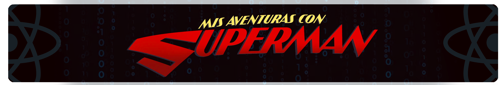

<!-- ===================== HERO IMAGE ===================== -->

  

<!-- ===================== INTRO ===================== -->

<h1 align="center">Hi 👋, I'm Mohey Wael Ahmed</h1>

<h3 align="center">
  Front-End Developer | React.js | JavaScript
</h3>

  I build modern, responsive, and user-focused web applications
  with a strong focus on clean UI, performance, and great user experience.

<!-- ===================== TECHNOLOGIES ===================== -->

<h2 align="center">🛠️ Technologies & Tools</h2>

  
  
  
  
  
  
  

<!-- ===================== ABOUT ME ===================== -->

## 👨‍💻 About Me

I'm a Front-End Developer focused on building modern web interfaces
using **React.js and JavaScript**.

I enjoy transforming ideas and designs into responsive, interactive,
and user-friendly web experiences.

I'm continuously learning and improving my skills in modern front-end
development, UI/UX, and web technologies.

<!-- ===================== CURRENT FOCUS ===================== -->

## 🚀 Currently

- 🔭 Working on React.js projects
- 🌱 Improving my Front-End development skills
- 🎨 Interested in UI/UX and modern web design
- 💡 Building practical projects to strengthen my experience
- 🤝 Open to collaboration and freelance opportunities

## 📫 Connect With Me

<!-- ===================== CONNECT ===================== -->

  
  &nbsp;&nbsp;&nbsp;
  
  &nbsp;&nbsp;&nbsp;
  

<!--
**moheywael/moheywael** is a ✨ _special_ ✨ repository because its `README.md` (this file) appears on your GitHub profile.

Here are some ideas to get you started:

- 🔭 I’m currently working on ...
- 🌱 I’m currently learning ...
- 👯 I’m looking to collaborate on ...
- 🤔 I’m looking for help with ...
- 💬 Ask me about ...
- 📫 How to reach me: ...
- 😄 Pronouns: ...
- ⚡ Fun fact: ...
-->
